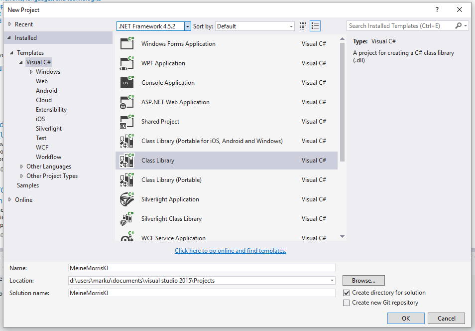
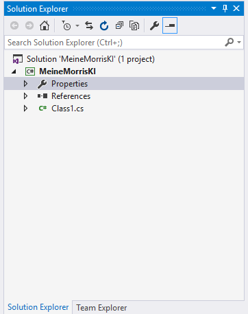
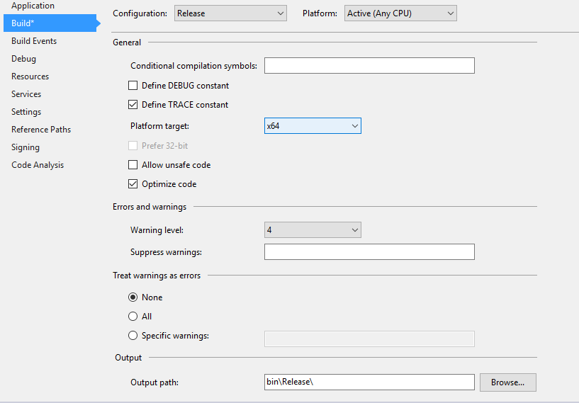
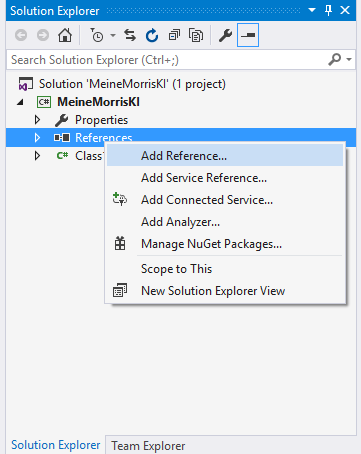

# Morris

Morris ist eine Implementation des klassischen Mühlespiels für die IT-Talents
Code Competition. Die Kerngedanken beim Design der Architektur der Software
waren Modularität und Erweiterbarkeit. Konkret heißt das, dass man bei Morris
nicht nur auf *einer* GUI gegen *eine* KI spielen kann, sondern vollkommen frei
und beliebig verschiedene GUIs, Methoden der Benutzereingaben und KIs an- und
abschalten kann. Die Kernsoftware stellt bereits einige dieser Module bereit,
allerdings ist es sehr einfach, selbst neue KIs und Benutzeroberflächen
hinzuzufügen. Dafür ist es nicht notwendig, den Quellcode von Morris selbst zu
modifizieren (tatsächlich ist es nicht einmal notwendig, den Quellcode zu
besitzen, die kompilierte ausführbare Datei ist ausreichend, um die Software zu
erweitern). Mehr dazu weiter unten.


## Inhalt dieser Readme-Datei

1. Benutzung der Software
  1. Übersicht
  2. Regelwerk
  3. Der Controller
  4. Ein- und Ausgabesysteme
  5. Die verfügbaren KIs
  6. Malom2Morris
    1. Was ist das?
    2. Kompilation und Datenbankerstellung
2. Überblick über die Architektur der Software und den Quellcode
  1. Hinweise zum Lesen des Quellcodes
  2. Grobüberblick über die Architektur
  3. Verzeichnis nicht automatisch generierter Quellcodedateien
3. Selbst Erweiterungen Entwickeln
  1. Basics
  2. Attribute


## Benutzung der Software

### Übersicht

Beim Start der Software öffnet sich der sogenannte Controller. Hier kann
festgelegt werden, wer gegen wen spielt (dabei kann es sich sowohl um
menschliche Spieler als auch KIs handeln, das heißt es sind auch Runden
von Mensch gegen Mensch oder KI gegen KI möglich) und auf welchen Formen von
GUI dies angezeigt werden soll. Wenn das Spiel gestartet wird, öffnen sich dann
die ausgewählten GUIs, auf denen dann das Spiel gespielt bzw. angeschaut werden
kann.

### Regelwerk

Die vorliegende Implementation stützt sich auf die Mühle-Regeln nach [1] mit einer
Zusatzregel. Folgende Regeln kommen zum Einsatz:

* Wenn in einem Zug mindestens eine Mühle geschlossen wird, wird immer exakt ein
  Stein entfernt. In anderen Worten: Wenn zwei Mühlen geschlossen werden, darf
  trotzdem nur ein Stein entfernt werden. Befinden sich alle gegnerischen Steine
  in einer Mühle, darf ein beliebiger gegnerischer Stein entfernt werden.
* Das Spiel endet unentschieden, wenn eine Spielsituation einmal wiederholt wird
* Das Spiel endet außerdem unentschieden, wenn für 50 Züge kein Stein platziert
  oder geschlagen wurde.
* Ansonsten verliert ein Spieler, wenn er nur noch zwei Steine hat oder keinen
  gültigen Spielzug machen kann.

### Der Controller


Der Controller kontrollliert das aktuelle Spiel. Die beiden Dropdowns legen
fest, welche KI oder welcher Spieler die entprechende Partei im Spiel
kontrollieren. Durch die Liste "Anzeigen" wird festgelegt, auf welchen Formen
der GUI das Spiel angezeigt wird. Mehrfachauswahlen sind hier möglich. **Sowohl
die Anzeigen als auch die Spieler/KIs können geändert werden, während ein Spiel
im Gang ist.**

Der
Slider "Verzögerung" legt fest, wie lange gewartet werden soll, bis nach einem
Zug der nächste Zug angefordert wird. Diese Funktion kann verwendet werden, um
Spiele zwischen zwei KIs in einem angenehmen Tempo anzuschauen. Ein Klick auf
"Neues Spiel" bricht ggf. das aktuelle Spiel ab und startet ein neues Spiel.

Auf der rechten Seite des Controllers befindet sich eine Liste mit den bisherigen
Spielzügen. Mit einem Doppelklick auf einen Spielzug wird das Spiel bis zu
diesem Spielzug "zurückgespult".

Mit dem Button "Assembly laden..." können Module geladen werden, die weitere
KIs oder GUIs enthalten.

### Ein- und Ausgabesysteme

Morris stellt von Haus aus zwei Möglichkeiten bereit, ein Spiel anzusehen und
zu Spielen: Ein Konsoleninterface und eine GUI.

#### Konsole


Die Konsole ist in der Lage, das Spielfeld wie in der obigen Abbildung zu
zeichnen und Züge entgegenzunehmen. Züge müssen sich im selben Format wie im
Controller befinden (mit Ausnahme der Großschreibung), das heißt:

* A1 bedeutet, dass ein neuer Stein auf A1 gelegt werden soll.
* A1-D1 bedeutet, dass der Stein auf A1 nach D1 geschoben werden soll.
* ,G1 an einen Zug anzuhängen bedeutet, den gegenerischen Stein auf G1
  zu entfernen

Sollte ein eingegebener Zug nicht dem Format entsprechen oder in der aktuellen
Spielsituation ungültig sein, fragt die Konsole direkt nach einem neuen Zug.

#### GUI


Die GUI sollte im Großen und Ganzen selbsterklärend sein. In der
Statuszeile oben steht, welche Form von Benutzereingabe gerade erwartet wird.
Spielsteine können wie erwartet durch Drag&Drop gezogen bzw. per Mausklick
gesetzt werden.

### Die verfügbaren KIs

Morris stellt ein paar KIs bereit:

Name | Beschreibung
--- | ---
Zufalls-KI | Die dümmste aller KIs. Sie wählt einen zufälligen gültigen Spielzug aus.
Dumme KI | Eine sehr eindimensional denkende KI, die nicht vorausdenkt, sondern einfach nur den besten direkt folgenden Zug basierend auf einer schwachen Heuristik auswählt, der sehr anfällig für lokale Maxima ist.
Einfacher Negamax | Eine KI, die den [Negamax-Algorithmus](https://en.wikipedia.org/wiki/Negamax) in einfacher Form realisiert und vier Züge vorausdenkt, sich aber zum Teil ein paar Sekunden Zeit für einen Zug lässt.
Malom3: Heuristische KI\* | Eine recht fortgeschrittene KI basierend auf dem Minimax-Algorithmus mit Alpha-Beta-Pruning.
Malom3: Perfekter Spieler\* | Eine KI, die basierend auf einer im Voraus berechneten Datenbank stets den spieltheoretischen Wert der Spielsituation erreicht (d.h., wenn es bei perfekt spielendem Gegner möglich ist, in der Situation zu gewinnen, gewinnt sie auch). Es ist nicht möglich, gegen diese KI besser als unentschieden zu spielen.

\*) Diese KIs sind im Modul Malom2Morris enthalten. Siehe hierzu den nächsten Abschnitt.

### Malom2Morris

#### Was ist das?

Das klassische Mühlespiel wurde Mitte der 90er zum ersten Mal gelöst (im Sinne von,
es wurde bewiesen, dass zwei perfekte Spieler stets unentschieden spielen) [1].
Was damals noch Supercomputer vorraussetzte, kann mittlerweile auf dem eigenen
Rechner nachgemacht werden. 2014 haben Wissenschaftler aus Ungarn eine Software namens Malom3
veröffentlicht, die (unter anderem) einen perfekten Spieler für das herkömmliche
Mühlespiel implementiert [2]. Wäre es nicht cool, wenn diese perfekte KI auch in
dieser Plattform, Morris, verfügbar wäre?

Zu diesem Zweck habe ich das Modul Malom2Morris entwickelt, welches sich in Malom
einklinkt und die beiden in Malom enthaltenen Computerspieler für Morris verfügbar macht.
Dies wird realisiert, indem Malom2Morris den Spielzustand von dem in Morris verwendeten
Format in das Malom3-Format übersetzt, den Malom3-Spieler dann mit dieser übersetzten
Spielinformation füttert und dann den berechneten Zug vom Malom3-Format wieder in
das Morris-Format übersetzt, sodass dieser dann von Morris verwendet werden kann.

#### Kompilation und Datenbankerstellung

**Anmerkung:** Malom3 stützt sich auf eine ca. 78 GB große Datenbank, in der sich
praktisch alle Mühlespielsituationen befinden. Da diese Datenbank
Online nicht verfügbar ist, muss sie auf dem eigenen Rechner berechnet werden.
Dies benötigt mindestens 16GB Arbeitsspeicher, logischerweise 78GB freien Festplattenspeicher
und ca. 24 Stunden Rechenzeit. Sehr geehrte Mitarbeiter von IT-Talents und der Gauselmann-AG,
ich kann verstehen, wenn Ihnen das für eine Einsendung zu viel Aufwand ist. Für
diesen Fall finden sie [hier]() ein Video, wie es aussieht, gegen diese Spieler zu
spielen. Ich kann aber auch wärmstens empfehlen, sich die Mühe zu machen und selbst
gegen diese KI zu spielen, da der vorausschauende Spielstil des perfekten Spielers
sehr faszinierend ist und gleichzeitig beeindruckend, wie man vollständig in
Grund und Boden gespielt wird.

Um Malom3/Malom2Morris zu kompilieren wird Visual Studio 2015 benötigt. Die
kostenlose Community Edition kann [hier](https://beta.visualstudio.com/vs/community/)
heruntergeladen werden.

1. Der Quellcode von Malom3 und Malom2Morris kann [hier](https://github.com/TwoFX/Malom2Morris/releases/tag/v1.0)
als Zip-Datei heruntergeladen werden. Die Zip-Datei sollte dann entpackt werden.
2. Als nächstes sollte die Datei `Malom_megoldas.sln` im Ordner `Malom_megoldas`
mit Visual Studio geöffnet werden.
3. Wählen Sie in den drei Dropdowns in der Toolbar die Einträge `Release`, `Any CPU` und `Controller`.

  

4. Klicken Sie rechts im Solution Explorer mit der rechten Maustaste auf `Controller`
und wählen Sie `Properties`.

  

5. Wählen Sie in dem sich öffnenden Dialog den Reiter `Debug` und fügen Sie bei `Working directory`
den Pfad zu dem Ordner `working` ein, der mit der Zip-Datei entpackt wurde.

  

6. Öffnen Sie durch den Solution Explorer die Datei `common.h` wie abgebildet.

  

7. Navigieren Sie in der Datei zu Zeile 145. Ersetzen Sie den Dateipfad dort zu
dem Ordner `dataaux`, den Sie mit der Zip-Datei entpackt haben.

  

8. Machen Sie den Eintrag `Morris` an der abgebildeten Stelle im Solution Explorer
ausfindig. Entfernen Sie ihn mit der Entfernen-Taste.

  

9. Rechtsklicken Sie auf den Eintrag `References` und wählen Sie `Add Reference...`

  

10. Klicken Sie in dem Dialog unten auf Browse, navigieren Sie zu Morris.exe, die
Sie entweder heruntergeladen oder kompiliert haben und bestätigen Sie die Auswahl.
Schließen Sie den Dialog dann mit `OK`.

  

11. Wählen Sie im Menü `Build` nun `Build Solution`.

  

12. Warten Sie ca. 30 Sekunden, bis am unteren Rand des Fensters `Rebuild All succeeded` erscheint.

  

13. Klicken Sie in der Toolbar nun auf `Start`.

  

14. Das Fenster zur Berechnung der Datenbank öffnet sich. Setzen Sie einen Haken bei `Automatic`.

  

15. Warten Sie ca. 24 Stunden, bis beide Fortschrittsbalken dreimal durchgelaufen sind.
Sobald die Berechnung abgeschlossen ist, öffnet sich ein Dialog mit dem Inhalt `Everything Done`.

  

16. Kopieren Sie nun die 9 Dateien, die sich im Ordner `Malom2Morris-1.0\Malom_megoldas\Malom2Morris\bin\Release`,
befinden, in den Ordner `Malom2Morris-1.0\working`.

  

17. Öffnen Sie nun `Morris.exe` und importieren Sie durch Klick auf `Assembly laden...` `Malom2Morris.dll`.

  

18. Fertig! Sie können nun gegen den perfekten Spieler verlieren.

  

## Überblick über die Architektur der Software und den Quellcode

### Hinweise zum Lesen des Quellcodes

Die Software ist in C# 6 verfasst. Ob der längeren Liste der erlaubten Sprachen
gehe ich davon aus, dass nicht jeder Leser dieses Quellcodes zu einhundert Prozent
mit dieser Sprache vertraut ist. Da der Code von diesen beiden Features extrem starken Gebrauch macht,
empfehle ich dem geneigten Leser, sich vor der Lektüre des Codes, falls notwendig,
mit Lambda-Ausdrücken und LINQ (wieder) vertraut zu machen.

### Grobüberblick über die Architektur

Wie eingangs erwähnt lag der Kernfokus beim Design der Applikation auf Modularität.
Die Software besteht aus mehreren relativ autonomen Teilen: Zentral ist die Kernlogik
(Codedateien im Ordner `Core`). Hier befindet sich die Logik des Mühlespiels in Klassen
wie `Game`, `GameState`, etc., in denen das Spiel selbst ausgetragen wird. Die Kernlogik
kommuniziert über zwei Punkte mit dem Rest des Projekts: Auf der einen Seite über die Klasse
`Game`, weil mit dieser ein tatsächliches Mühle-Spiel erstellt und verwaltet werden kann;
auf der anderen Seite über die beiden Interfaces `IMoveProvider` und `IGameStateObserver`,
die auf austauschbare Weise einen Spieler bzw. eine Anzeige kapseln. Klassen, die damit
zutun haben, das Spiel zu kontrollieren, befinden sich im Ordner `Control`. Klassen, die
Spieler oder Anzeigen bereitstellen, befinden sich in den Ordner `UI` und `AI`.

Jede Klasse besitzt im Quellcode einen `<summary>`-Block, der erklärt, was die Funktion der Klasse
ist. Weiter möchte ich in dieser Readme-Datei über den Code auch gar nicht verlieren,
da ich den Versuch unternommen habe, den gesamten Quellcode leserlich zu gestalten
und zu kommentieren (wobei ich bitte, meine teilweise etwas ausschweifenden Kommentare
zu entschuldigen).

### Zum Quellcode vom Malom2Morris

Der Großteil des Codes im Malom2Morris-Repository wurde nicht von mir verfasst,
sondern ist Teil von Malom. Die einzige vollständig von mir verfasste Datei ist
die Brücke selbst, welche sich in der Datei [`BridgedPlayer.cs`](https://github.com/TwoFX/Malom2Morris/blob/v1.0/Malom_megoldas/Malom2Morris/BridgedPlayer.cs)
befindet. Weiterhin habe ich am Malom3-Quellcode diverse Änderungen (Hacks) unternommen,
die notwendig waren, weil a) die KIs in Malom3 sehr eng gekoppelt mit der
Benutzeroberfläche sind und Änderungen notwendig waren, um überhaupt an die Züge
heranzukommen und b) als indirekte Konsequenz aus Grund A eine anderes Threading-Konzept
als Morris hat, sodass weitere Änderungen notwendig waren, damit der Zug dann auf
dem richtigen Thread verfügbar war. Diese Änderungen sind nicht sonderlich interessant,
falls aber auch irgendeinem Grund dennoch Interesse daran besteht, können die Änderungen
[hier](https://github.com/TwoFX/Malom2Morris/compare/04922f...v1.0) eingesehen werden
(dafür ist das Projekt ja Open Source).

## Selbst Erweiterungen entwickeln

Um selbst Anzeigen oder KIs für Morris zu entwickeln, benötigen Sie Visual Studio 2015.
Die kostenlose Community Edition kann [hier](https://beta.visualstudio.com/vs/community/)
heruntergeladen werden.

### Basics

Erweiterungen für Morris sind .NET 4.5.2- bzw. C++/CLI-Klassenbibliotheken mit Zielplattform
x64 und einer Referenz auf Morris. Um ein neues Projekt einzurichten, das diese
Kriterien erfüllt, folgen Sie der folgenden Anleitung:

1. Erstellen Sie ein neues Visual Studio-Projekt vom Typ Visual C# Class Library.
Stellen Sie sicher, dass im Dropdown oben `.NET Framework 4.5.2` ausgewählt ist.

  

2. Doppelklicken Sie auf den Eintrag `Properties` im Solution Explorer.

  

3. Wählen Sie im sich öffnenden Dialog im Reiter `Build` das `Platform target` `x64`.

  

4. Wiederholen Sie Schritt drei, nachdem Sie bei `Configuration` `Release` ausgewählt haben.

5. Rechtsklicken Sie im Solution Explorer auf den Eintrag `References` und wählen Sie `Add Reference...`

  

6. Klicken Sie in dem Dialog unten auf Browse, navigieren Sie zu Morris.exe, die
Sie entweder heruntergeladen oder kompiliert haben und bestätigen Sie die Auswahl.
Schließen Sie den Dialog dann mit `OK`.

  

7. Fertig. Das Projekt ist nun bereit.

Das absolute Minimalbeispiel, für eine KI, die Sie jetzt erstellen können,
sieht folgendermaßen aus:

```
using System.Linq;
using Morris;

namespace MeineMorrisKI
{
    public class MeineKI : IMoveProvider
    {
		public GameMove GetNextMove(IReadOnlyGameState state)
		{
			return state.BasicMoves().First();
		}
    }
}
```

Anzumerken ist, dass diese KI nicht zwangsläufig einen gültigen Zug produziert.

Wenn Sie dieses Projekt nun mit der Taste F6 kompilieren, befindet sich im Ordner
`bin/Debug` bzw. `bin/Release` des Projektordners dann eine `.dll`-Datei, die von
Morris mit Hilfe des `Assembly laden...`-Knopfes eingelesen werden kann.

### Attribute

Zusätzlich zum reinen Implementieren des Interfaces kann eine Klasse noch zwei Attribute
nutzen, um ihr Verhalten bezüglich Morris zu modifizieren.

#### `SelectorNameAttribute`

Wird die Klasse folgendermaßen deklariert:

```
[SelectorName("Meine KI")]
public class MeineKI : IMoveProvider
```

Dann erscheint im Auswahldialog des Kontrollers für die KI nicht der Klassenname
`MeineMorrisKI.MeineKI`, sondern der etwas freundlichere Name `Meine KI`.

### `SingleInstanceAttribute`

Wird die Klasse folgendermaßen deklariert:

```
[SingleInstance]
public class MeineKI : IMoveProvider
```

Dann wird die Klasse MeineKI, auch wenn sie beide Spieler steuern soll, nur einmal
instanziiert. Dies ist beispielsweise dann von Bedeutung, wenn eine Klasse gleichzeitig
`IMoveProvider` und `IGameStateObserver` implementiert, wie zum Beispiele eine GUI.
damit nicht ein Fenster für jeden Spieler und ein Fenster für die Anzeige verwendet
wird, wird das `SingleInstanceAttribute` gesetzt.

---

Wenn Sie es geschafft haben, die ReadMe bis hierher zu lesen, bleibt mir nur noch,
Ihnen viel Spaß beim Spielen zu wünschen.

## Literatur

1. Gasser, Ralph. "Solving nine men’s morris." Games of no chance, MSRI Publications 29 (1998): 101-113.
   Online verfügbar unter [http://library.msri.org/books/Book29/files/gasser.pdf](http://library.msri.org/books/Book29/files/gasser.pdf).
2. http://compalg.inf.elte.hu/~ggevay/mills/ (zuletzt abgerufen am 31. August 2016).
